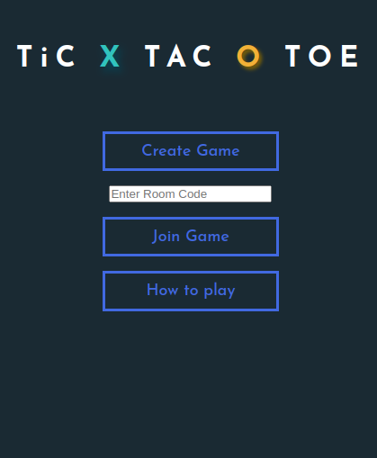
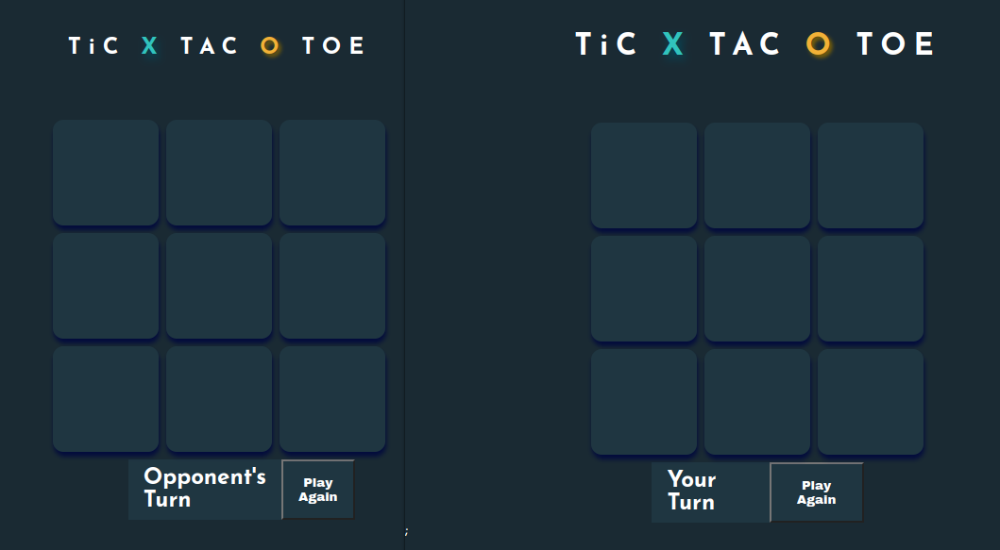
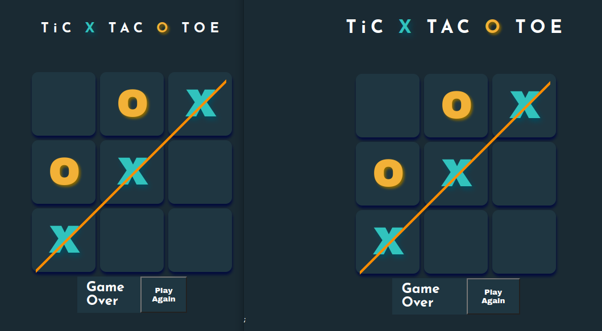
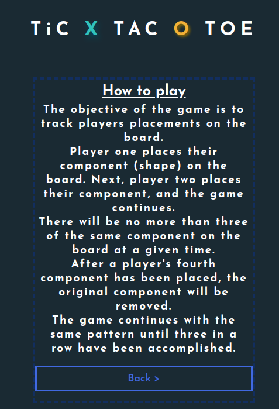

# TiC - TAC - TWIST
Tic-Tac-Twist is game that I made as a final project for my Fullstack bootcamp.  
  
the game shares the same rules as the original tic-tac-toe game with his own twist  
## Table of contents
* [General info](#general-info)
* [Technologies](#technoologies)
* [Setup](#setup)
* [Screenshots](#screenshots)

## General Info
As the projects run you'll encounter the main menu where you'll have 3 tabs to interact with:  
  
**Create Room** - creates a new socket to a room with a unique id and an initialized board game.  
**Join Room** - copy the id from the created room and paste it in the input bar and then click join in order to join that room  
**How To Play** - shows the rules of the game  

game starts once both clients are logged into the same socket room.

### Rules
The objective of the game is to track palyers placements on the board. player one places their component (shape) on the board. Next, player two places their component, and the game continues.  
There will be no more than three of the same component on the board at a given time. After a player's fourth component has been placed, the original component will be removed.  
The game continues with the same pattern until three in a row have been accomplished.

## Technologies
The project is created with:  
### Frontend
* ReactJS
* Vite
* CSS / Styled-Components
### Backend
* Nodejs
* Express
* Sockets

## Setup
To run this project, install it locally using npm:  
```
$ cd ../client
$ npm install
$ npm run dev
```

To run the server, install it using npm aswell:
```
$ cd ../server
$ npm install
$ npm run devStart
```

## Screenshots
The main menu:  
    
The game once a game is created:  
    
A winning POV:
    
The game rules:  

